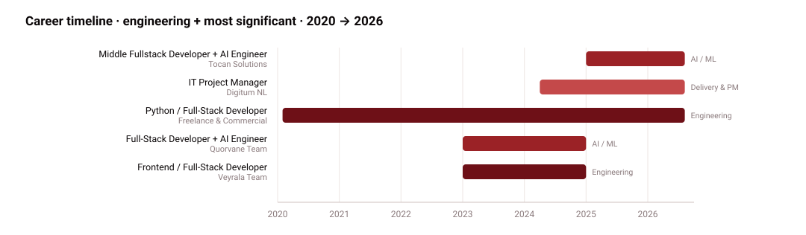
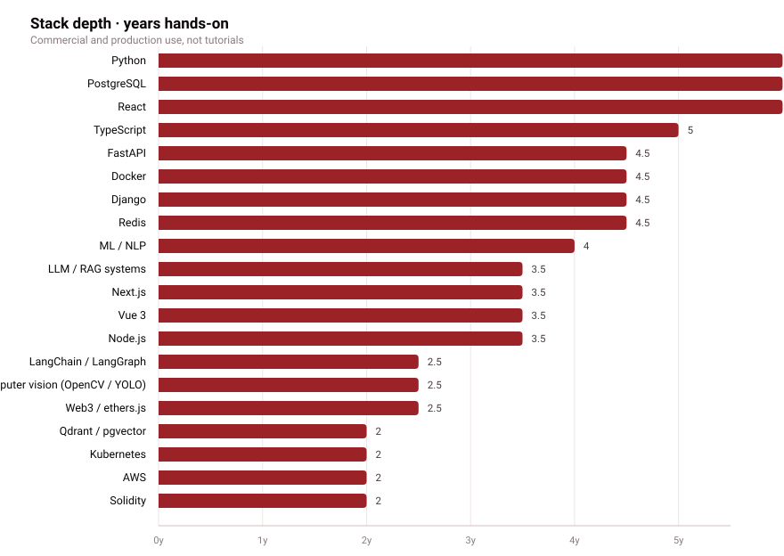

---

> **AI Engineer & Full-Stack Developer** with commercial experience since 2020.
> From LLM integration and RAG pipelines to production-grade backends and Web3
> interfaces — I keep code, product and delivery in one system.

Currently **Fullstack Developer + AI Engineer @ Tocan Solutions** and **IT
Project Manager @ Digitum NL**. Before that, **Full-Stack Developer + AI Engineer** — multimodal retrieval, agentic RAG, computer
vision and voice automation. Building with ML/NLP since 2022, in commercial AI
engineering roles since 2023. Finishing a **BSc in Cybersecurity** at Ivan Franko National
University of Lviv (GPA 89.15). Open to AI products, Web3/Crypto, Cybersecurity and
complex SaaS.

---

## 🧬 What I do

| | Focus | Working with |
|:--:|---|---|
| 🧠 | **AI / LLM engineering** | Claude 4 · GPT-4o · Gemini 2 · LangGraph · LangChain · Claude Agent SDK · MCP · RAG (Qdrant, pgvector, Pinecone) · Whisper · ElevenLabs · OpenCV / YOLO |
| ⚙️ | **Backend & data** | Python (FastAPI, Django, Flask) · Node.js · PostgreSQL · Redis · Celery · Elasticsearch · Kafka · gRPC · WebSockets |
| 🎨 | **Frontend** | React 19 · Next.js 15 · Vue 3 · TypeScript · Tailwind · Three.js / R3F · Framer Motion |
| ⛓️ | **Web3** | Solidity · ethers.js · viem · wagmi · RainbowKit · WalletConnect · tokenomics dashboards · wallet-centric UX |
| 🛡️ | **Security** | OWASP Top 10 · SIEM (Elastic, Wazuh) · Sigma / YARA · CodeQL · Semgrep · Trivy · SBOM · threat modeling |
| 🚀 | **Delivery** | Scrum · Kanban · roadmapping · stakeholder management · 30+ projects, 98% on-time |

---

## 🛠 Stack

**Languages**

**AI / ML**

**Backend & infra**

**Frontend & Web3**

---

## 📈 Career

<picture>
  <source media="(prefers-color-scheme: dark)" srcset="assets/timeline-dev-plus-noir-dark.svg">
  
</picture>

<picture>
  <source media="(prefers-color-scheme: dark)" srcset="assets/stack-noir-dark.svg">
  
</picture>

---

## 🚢 Selected work

| Project | What it does | Stack |
|---|---|---|
| **AI SecOps Command Center (SOAR)** | SIEM alert ingest (Elastic/Wazuh), graph-database correlation, ML incident scoring and automated playbooks. An LLM agent writes the human-readable incident card. Alert triage went from ~15 min to under 2. | FastAPI · React 19 · Elastic/Wazuh · graph DB · Sigma/YARA · LangGraph · Postgres 17 |
| **Multimodal Media Intelligence** | Streaming pipeline over documents (OCR/VLM), audio (Whisper) and video (frame sampling + YOLO/CLIP) into a Qdrant hybrid-search index, with GPT-4o entity extraction and a Celery queue sized for hundreds of hours of content. | FastAPI · Celery 5 · Whisper · YOLO + CLIP · Qdrant · Elasticsearch 8 |
| **RAG Knowledge Base + Agentic Tool Calling** | Assistant with dynamic query routing: semantic search (Qdrant + ColBERT), a SQL agent for metadata and a REST agent for CRM. Reflection and validation nodes cross-check facts across passes to keep hallucinations out. | LangGraph · Qdrant · ColBERT · Claude Agent SDK · MCP · FastAPI |
| **Observer Suite** | GPU-ready microservice computer vision over 16+ concurrent RTSP streams: face detection and recognition (FaceNet), QR scanning, object tracking, zone analytics, live React dashboard. | OpenCV 4 · YOLOv8 · TensorRT · CUDA 12 · Go 1.23 · Redis Pub/Sub · WebSockets |
| **Secure SDLC AI Co-pilot** | CodeQL/Semgrep findings parsed, contextualised via RAG over the project wiki and turned into fix tickets. A second agent builds data-flow diagrams and a STRIDE threat model from code and infra configs. | GitHub Actions · CodeQL · Semgrep · Trivy · SBOM · Next.js 15 · RAG |
| **Logistics Request Intelligence** | Hybrid NLP/ML pipeline: TF-IDF + RandomForest for fast categorisation, a fine-tuned local Qwen 2.5 for entity extraction with Pydantic validation, and an agentic fallback to GPT-4o when the local model is unsure. | FastAPI · scikit-learn · Ollama/Qwen 2.5 · Pydantic v2 · LangGraph |
| **Web3 Products Suite** | Crypto casino, on-chain dice and a token launch platform in one product line: Solidity contracts with verifiable randomness, 3D table animations, wallet-centric UX and real-time bet/payout events. | Solidity · Chainlink VRF · Next.js 15 · React Three Fiber · RainbowKit + wagmi 2 |
| **OwlView** | Secure survey platform for research teams: role-based access, encryption, action auditing and AI-assisted questionnaire generation. Backed by three conference papers. | React 19 · Flask 3 · Postgres 17 · Vault · MinIO · Docker 27 |

More systems I have built

| Project | What it does |
|---|---|
| **Way Recognize** | Geospatial routing platform: OSM PBF extracts parsed with osmium into a normalised road graph on MongoDB, an OSRM cluster provisioned and rebuilt automatically in Docker with versioned Lua speed profiles, and a Pyramid REST API for routes and distance matrices. Hot numeric paths accelerated with Numba. |
| **AI-Powered EDO Service** | B2B document workflow with hybrid access (RBAC, SSO vs eID) and in-browser qualified e-signature via ІІТ Користувач ЦСК-1 — no third-party install. REST API for 1C and WMS/TMS, phase 2 targeting the state e-TTN system. |
| **PC Resource Intelligence Monitor** | System agent collecting CPU/GPU (CUDA)/RAM/disk telemetry into a time-series store; Isolation Forest / LSTM flag anomalies, predict degradation and name the offending PID. |
| **AI Presentation & Report Generator** | LangGraph agent decomposes a brief into an outline (JSON schema), slide copy (GPT-4o) and imagery (SDXL/Flux), then assembles a corporate-styled .pptx via python-pptx. |
| **Automated Reels Suite** | Claude writes the script, ElevenLabs voices it, footage is assembled from Pexels and Flux frames, subtitles burned in with Whisper timings + MoviePy, published through the official TikTok/Instagram/YouTube APIs. |
| **Adaptive Voice Survey Automation** | Low-latency outbound calling with Voice Activity Detection (Deepgram / Whisper Streaming + ElevenLabs), agentic dialogue branching on LangGraph, post-call diarisation and trigger detection. |
| **Tokenomics Dashboard & Vesting Analyzer** | On-chain parsing via The Graph and Dune, visualising token distribution, unlocks and sell pressure, with an AI agent forming hypotheses from comparable projects. |
| **TV Rating & AD-buy Intelligence** | XMLTV schedule parsing matched against Nielsen/GfK ratings, broadcast heatmaps and an ML model forecasting reach by time slot and genre. |
| **Remnants — PC game** | Solo game project on [itch.io](https://deussbelli.itch.io/remnants): game-loop architecture, procedural content generation and enemy AI on behaviour trees / state machines. |

---

<!-- GitHub stats section — hidden on purpose. Uncomment to bring it back.
## 📊 GitHub

<picture>
  <source media="(prefers-color-scheme: dark)" srcset="https://github-stats-extended.vercel.app/api?username=deussbelli&show_icons=true&hide_border=true&include_all_commits=true&count_private=true&theme=dark&bg_color=12100A&title_color=F0A72A&icon_color=FBD87F&text_color=E0D3B8">
  
</picture>
<picture>
  <source media="(prefers-color-scheme: dark)" srcset="https://streak-stats.demolab.com?user=deussbelli&hide_border=true&theme=dark&background=12100A&ring=F0A72A&fire=F0A72A&currStreakLabel=F0A72A&sideLabels=E0D3B8&dates=A89878">
  
</picture>

<picture>
  <source media="(prefers-color-scheme: dark)" srcset="https://github-stats-extended.vercel.app/api/top-langs/?username=deussbelli&layout=compact&hide_border=true&langs_count=10&theme=dark&bg_color=12100A&title_color=F0A72A&text_color=E0D3B8">
  
</picture>

<picture>
  <source media="(prefers-color-scheme: dark)" srcset="https://github-readme-activity-graph.vercel.app/graph?username=deussbelli&theme=github-compact&bg_color=12100A&color=E0D3B8&line=F0A72A&point=F0A72A&hide_border=true">
  
</picture>

&#45;&#45;-

-->

## 🎓 Beyond code

**Education** — BSc Cybersecurity & Information Protection, Ivan Franko National
University of Lviv, Faculty of Applied Mathematics and Informatics (2022–2026, GPA 89.15).

**SecOps Analyst L1 · SoftServe** (2025–2026) — cyber incident response unit: alert triage,
incident investigation, baseline playbooks. The hands-on half of the AI SecOps Command Center below.

**Publications**
- *Secure Platform for Social Surveys: Integration of Encryption Technologies and Access Control for Data Confidentiality* — AMICon-2025, pp. 291–297
- *Development of a Secure Platform for Social Surveys* — AMICon-2026
- *Integration of Private Blockchain and Chaum Blind Signatures for Anonymity and Integrity of Data Collection in the OwlView Platform* — ITSEC-2026 (in press, with V. Trushevskyi)

**Certifications** — RangeForce (2026) · Cisco Introduction to Cybersecurity (2022) ·
Project Manager & Product Manager, New Economy Business School by SUPERLUDI (2025)

**Languages** — Ukrainian (native) · Russian (native) · English (B2)

---

### 💼 Open to work

**AI Engineer · Full-Stack · Tech PM** in AI products, Web3/Crypto,
Cybersecurity and complex SaaS.
Remote (EU timezone) or hybrid Lviv · full-time B2B contract (FOP 3rd group).

